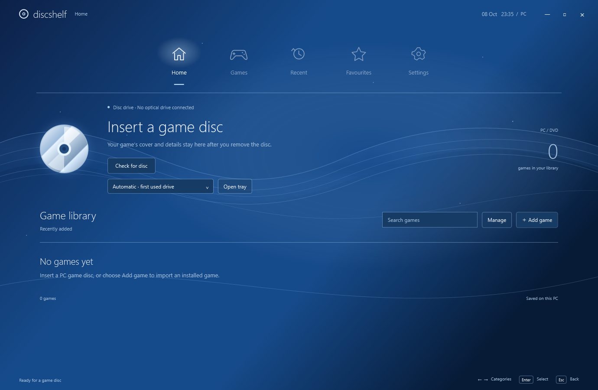
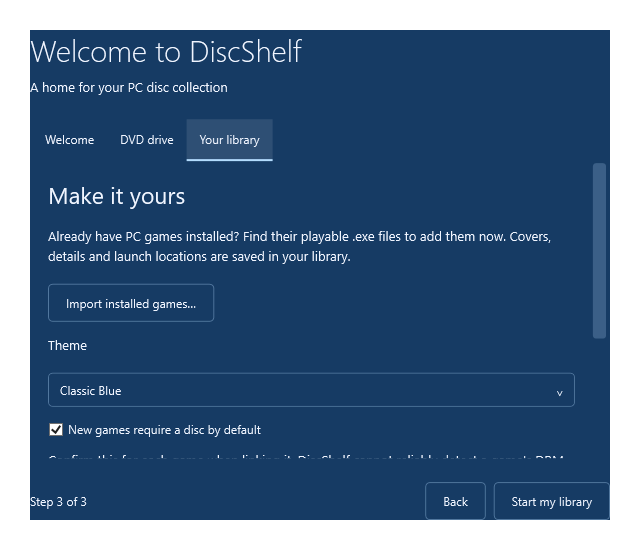

# DiscShelf v1 · version 1.3

A native Windows launcher for PC CD/DVD games, with a PS3/PSP-inspired menu, animated waves, a saved library, configurable metadata sources, and importable themes.

[Download DiscShelf for Windows x64](https://github.com/HimariHikari/discshelf/releases/latest) · [Metadata sources](METADATA-SOURCES.md) · [Theme guide](THEMES.md)



## Start

Download **DiscShelf-Windows-x64.zip** from [Releases](https://github.com/HimariHikari/discshelf/releases/latest), extract it, then double-click **DiscShelf.exe**. If building from source, the executable is in `release`. The standalone Windows x64 build includes .NET. Wikipedia/Wikidata work without an account or key; RAWG and IGDB are optional.

First launch opens a three-step setup for your DVD drive, theme, library defaults, and metadata preferences. Finishing setup saves your choices. You can run it again through **Settings → Startup**. Existing libraries and their saved disc preferences remain compatible.



1. Keep DiscShelf open and insert a PC game disc. Automatic drive selection remembers the first drive used with an inserted disc. Before that, it uses a drive containing a disc or the first available drive.
2. Click any game tile to see its cover, description, year, developer and publisher. New libraries start empty; no example games or example covers are bundled.
3. Choose **Install from disc** to run the game's setup, or **Edit location** to link an existing installed copy. Setup, **Add game**, and **Settings → Library** all offer **Import installed games**: find the playable `.exe` files yourself, selecting multiple files when useful. Imported titles, locations and other information are saved in your local library. When first linking or playing a new imported game, confirm whether it needs its DVD to play. DiscShelf cannot reliably infer a game's DRM requirement from its DVD or metadata; change your choice on the game's information screen whenever needed.
4. **Play** checks the selected drive every time for games with **Check the game disc every time I press Play** enabled. If the drive is empty, it sends an open-tray command and asks you to insert the game. Press Play again after insertion. A different identified disc does not launch the game and is not automatically ejected. With this preference disabled, Play launches the saved installed executable directly, without checking for an optical drive.
5. Remove the disc. Its cover and saved information remain available.

Select a DVD drive using the dropdown on Home or **Settings → Disc drives**. Manual selection stays saved. A disconnected manually selected drive does not silently switch to another device. Open/close tray buttons are also available in Settings.

**Add game** accepts a typed title or an extracted disc folder. **Use inserted disc** links a manually added game to the current disc. **Change cover** copies your own PNG/JPG/BMP. **Edit details** lets you enter information yourself; **Find game details** searches available sources. **Search the web** is available when databases cannot identify an obscure disc.

Left/Right browses categories; Down moves into tiles; Enter selects; Up returns to the menu. Escape closes game information, clears search, or returns Home.

## Install, uninstall, and remove games

- **Install from disc**: insert the matching DVD or import an extracted disc folder, choose a suggested setup file or browse for its `.exe`/`.msi`, then complete the game's own wizard. DiscShelf tracks the process and offers to link the installed executable afterwards. Some setup launchers open a second wizard; finish it before linking. MSI operations use interactive Windows Installer with automatic restart disabled. Nothing runs just because a disc was inserted.
- **Find installed game**: search Windows' installed applications, select the correct game, then choose its playable executable. **Edit location** also supports games without Windows installation registration. Use **Settings → Library → Edit game locations** to choose new locations for individual saved games, and **Choose default game folder** to set the folder used when finding or importing games.
- **Uninstall**: select and confirm the correct Windows installation. DiscShelf reads the current user and machine uninstall registrations in both 32-bit and 64-bit views, starts the registered removal wizard, and checks whether the registration disappeared afterwards. Cancellation, failure, or incomplete verification keeps your library and launch link. An unsupported or missing registration can use **Choose uninstaller file**; after that wizard, you explicitly confirm its result.
- **Remove from library**: right-click a cover, press Delete while a game tile is focused, or use the information screen. **Manage** lets you select multiple games with Ctrl/Shift or Select all. This removes DiscShelf entries and leaves installed games and cached covers on your PC. **Undo removal** restores the last group removed during this session.

Removed disc identities stay excluded from automatic detection across restarts, so an inserted DVD does not immediately recreate a deleted entry. Use **Add this disc** to add it again, or **Settings → Library → Allow removed discs to be detected again** to clear exclusions. Uninstalling can keep the cover and details in DiscShelf; after a confirmed uninstall, you can choose whether to remove that entry too.

Installers and uninstallers use their original Windows wizards, including any Windows permission prompts. DiscShelf does not embed arbitrary vendor windows or recursively delete installation folders itself.

## Settings and themes

Settings has Appearance, Disc drives, Metadata, Startup, and Library pages. Options include eight colour themes, JSON import/templates, wave animation and brightness, particles, clock format, tile size, cover fit, font, drive selection, empty-tray opening, automatic scanning and interval, metadata sources/fallback, automatic lookup, cover downloads, boot screen/duration, maximised startup, start page, game import and locations, default game folder, play history, and minimising after launch.

The boot screen says **discshelfv1**. It is enabled by default and can be disabled in Startup settings.

See [THEMES.md](THEMES.md) for the JSON format. An editable theme example is included in `Themes/example-theme.json`. Import it through Appearance or drop your own JSON into the themes folder and reload.

## Metadata configuration

Edit **MetadataPolicy.cs** to change provider priority, endpoints, retries for missing data, external search links, or the provider registry. Default priority is IGDB → RAWG → Wikipedia; sources without credentials are skipped.

- Wikipedia + Wikidata: no key required; tested live.
- RAWG: optional personal API key.
- IGDB: optional Twitch client ID and client secret.

Credentials are entered under Metadata settings and encrypted for the current Windows user. Free non-commercial access to RAWG/IGDB is subject to their registration, attribution and request limits. Authenticated RAWG/IGDB live calls need your credentials; their response parsing and fallback paths were tested with fixtures.

Other sources can fill missing fields only when there is a single exact title match. Existing information is preserved and source links are retained. If no source finds a match, you can search the web or edit details manually. Editions, region-specific dates and PC ports still need review.

See [METADATA-SOURCES.md](METADATA-SOURCES.md) for source-code entry points, adapter registration and API documentation.

## Saved data

`%LOCALAPPDATA%\DiscShelf\` contains:

- `library.json`: games, metadata, source links, disc identities, favourites and play history.
- `artwork\`: cached covers.
- `settings.json`: saved preferences and Windows-encrypted credentials.
- `themes\`: imported JSON themes.

Library saves use atomic replacement and a backup. Damaged library files are preserved and recovered from backup where possible. Previous DiscShelf libraries remain compatible.

Back up the entire data folder. Launch paths and credentials may need to be reselected/re-entered on another computer. Removing a library entry leaves installed game files and cached artwork in place. Settings also save first-launch completion and removed disc identities.

## Practical limits

Disc recognition is a heuristic: volume serial, label, size, and root filenames identify the disc; its title comes from the label, autorun label, or executable metadata. Scan depth and file counts are bounded. Generic old installers and discs without artwork may need manual correction.

DiscShelf never runs installers or autorun commands automatically. Use **Browse disc** to install a game yourself. It does not copy game files or bypass DRM, disc checks, activation, or Windows compatibility requirements. Release years may describe the game's original release rather than its PC port. Recently played records a launch accepted by Windows, not proof that an old game started successfully.

Real tray movement and physical insertion could not be tested here because no optical drive is connected. The Windows eject/load command implementation and the missing/correct/wrong-disc decision paths are included; some drives require their physical tray button or reject software commands. An unreadable disc reported as ready is not automatically ejected.

## Build and verify

Install .NET 10 SDK on Windows:

```powershell
dotnet build DiscShelf.csproj -c Release
dotnet publish DiscShelf.csproj -c Release -r win-x64 --self-contained true -p:PublishSingleFile=true -p:IncludeNativeLibrariesForSelfExtract=true -p:DebugType=None -p:DebugSymbols=false -o release
```

Tests run in isolated temporary folders:

```powershell
Start-Process .\release\DiscShelf.exe -ArgumentList '--self-test' -Wait
Start-Process .\release\DiscShelf.exe -ArgumentList '--preview' -Wait
Start-Process .\release\DiscShelf.exe -ArgumentList '--startup-test' -Wait
Start-Process .\release\DiscShelf.exe -ArgumentList '--metadata-test' -Wait
```

The self-test verifies installer/uninstaller plans and process tracking with harmless child-process fixtures, cancellation/failure handling, removal verification, removed-disc exclusion, legacy library migration, drive selection, launch policy, encryption, settings, themes, metadata, cached artwork, and recovery. Preview renders Home, game details, setup, installation/removal dialogs, boot, themes, and Settings; it exercises removal/undo, multiple-game removal, selection/filtering, navigation, persistence, search, favourites and history. The startup test actually completes first-launch setup in an isolated data folder and checks that it does not repeat. The metadata test performs a live no-key lookup and cover download. Tests do not install or uninstall any real game on the test computer.

## Sources

[RAWG API](https://rawg.io/apidocs), [IGDB API](https://api-docs.igdb.com/), [MediaWiki query API](https://www.mediawiki.org/wiki/API:Query), [Wikidata access](https://www.wikidata.org/wiki/Help:Data_access), [Windows storage eject control](https://learn.microsoft.com/en-us/windows/win32/api/winioctl/ni-winioctl-ioctl_storage_eject_media).

Windows installation integration uses the [uninstall registry](https://learn.microsoft.com/en-us/windows/win32/msi/uninstall-registry-key), [Windows Installer commands](https://learn.microsoft.com/en-us/windows-server/administration/windows-commands/msiexec), and [Windows command-line argument parsing](https://learn.microsoft.com/en-us/windows/win32/api/shellapi/nf-shellapi-commandlinetoargvw).

Wikipedia descriptions retain source links and use CC BY-SA terms; Wikidata structured data uses CC0. Image rights vary and remain with their owners. No example game covers are bundled; downloaded covers and user-chosen artwork stay in the local data folder.

The UI, waves and disc illustration are native WPF. No external UI framework or NuGet packages are required.
